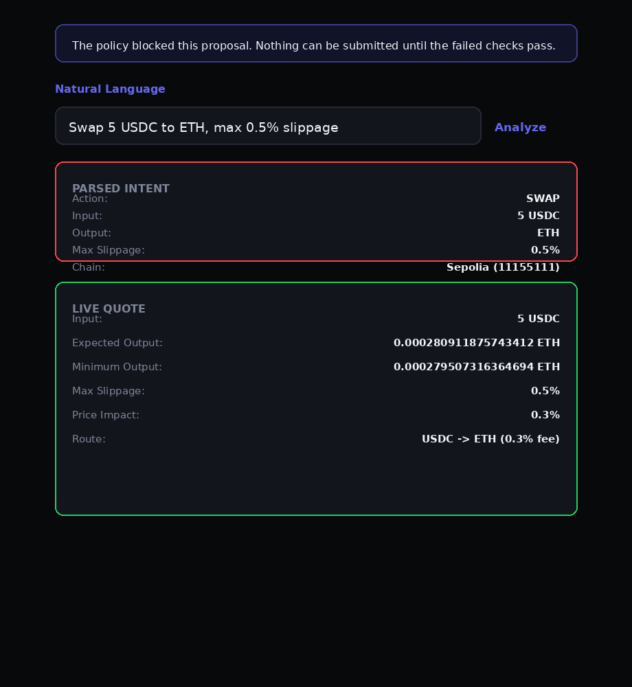
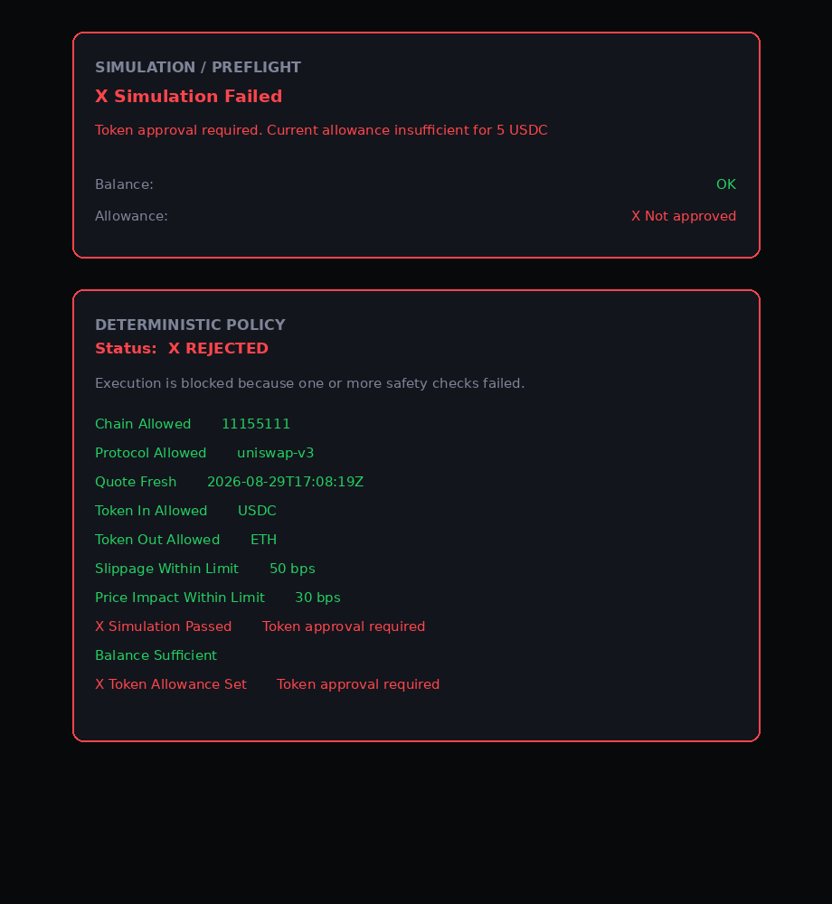
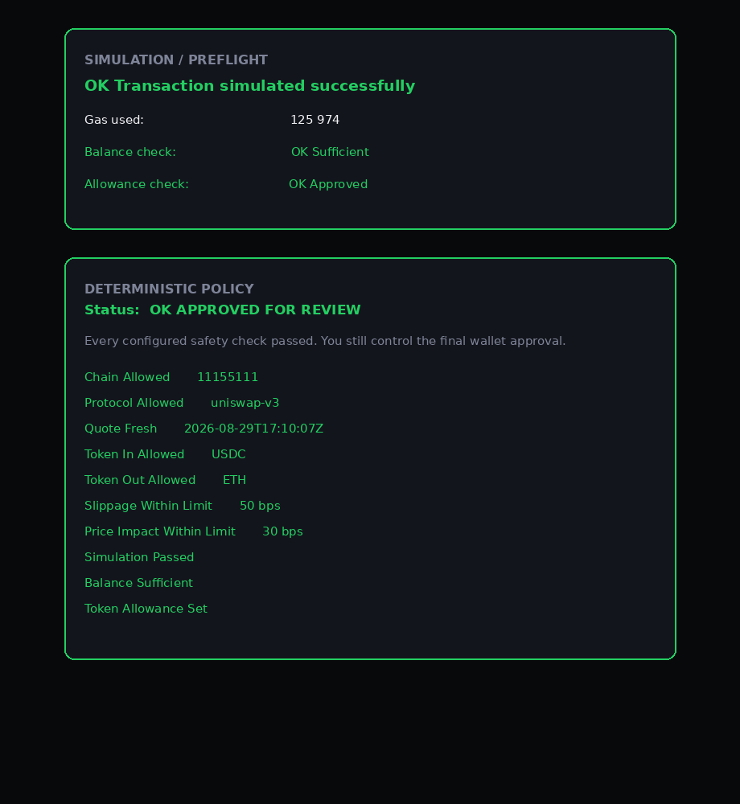
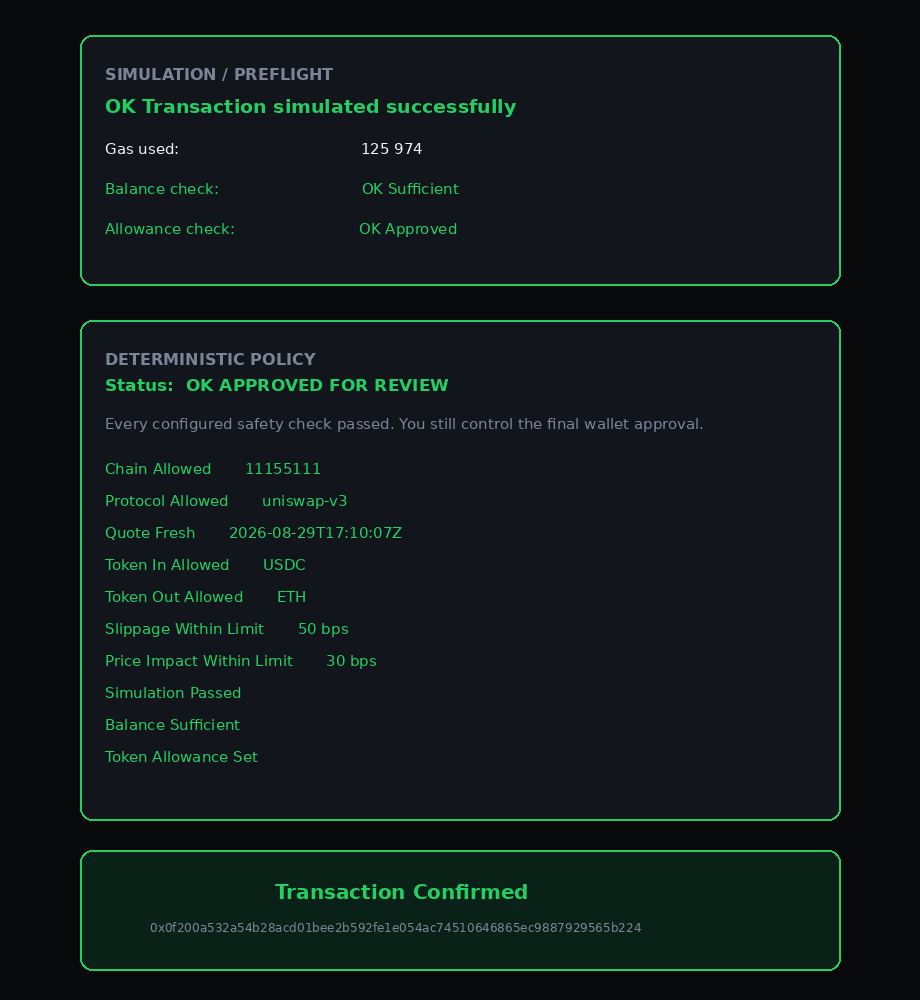

# IntentFi

**A safety and policy execution layer for onchain financial intents.**

Natural-language intents are converted into a strictly validated structured representation. Deterministic policy and transaction simulation enforce the safety boundary before the user signs anything.

> LLM proposes. Deterministic policy decides. Human approves. Blockchain executes.

---

## The Problem

AI agents that can read your wallet and broadcast transactions are a security nightmare waiting to happen. A single hallucinated parameter, a prompt injection, or a silently wrong slippage value can drain real funds, and no amount of "are you sure?" dialogs fixes that if the validation itself is probabilistic.

IntentFi solves this by **separating concerns**: AI may _propose_ a structured intent, but a deterministic policy engine _validates_ it, a transaction simulation _verifies_ it, and the human _signs_ it. No single layer, and certainly no LLM, has unilateral authority over funds.

---

## Architecture

```
Natural Language Input
      ↓
Structured Intent (deterministic-first hybrid parser)
      ↓
Deterministic Policy Engine
      ↓
Transaction Simulation / Preflight
      ↓
Human Approval (MetaMask)
      ↓
Onchain Execution (Uniswap V3, Sepolia)
```

| Layer | What it does |
|---|---|
| **Intent Parser** | Converts free-text input into a validated `SwapIntent` struct. The shipped UI tries the deterministic regex parser first, then uses Gemini 3.6 Flash only as a fallback for complex phrasing when configured. |
| **Policy Engine** | Pure deterministic code. Checks chain allowlist, protocol allowlist, token allowlist, slippage bounds, price impact ceiling, quote freshness, and balance/allowance sufficiency. Any violation blocks execution. |
| **Simulation / Preflight** | Runs balance check, allowance check, gas estimation, and full `eth_call` simulation against the real chain state before the user is asked to sign. Failed simulation = blocked transaction. |
| **Human Approval** | The user reviews the complete transaction preview (amounts, rates, fees, policy results, simulation outcome) and explicitly signs via MetaMask. No blind approvals. |
| **Onchain Execution** | Uniswap V3 SwapRouter02 with deadline-protected `multicall`. Token approval is scoped to the exact input amount (no unlimited approvals). |

---

## AI Transparency

> **This section is intentionally honest. Read it.**

The shipped demo uses a **two-stage hybrid parser**. `tryFallbackParse()` runs first, instantly and deterministically. If it cannot understand the phrasing and `VITE_GEMINI_API_KEY` is configured, `parseIntent()` calls Gemini 3.6 Flash as an LLM fallback.

Both parser outputs pass through the same strict `validateSwapIntent()` function before entering the policy engine. The LLM can propose structured intent data, but it cannot generate calldata, decide policy results, or bypass validation.

The policy engine, simulation layer, and execution path remain **fully deterministic** and have no LLM dependency.

📄 **Full details:** [`AI_DISCLOSURE.md`](./AI_DISCLOSURE.md)

---

## Quick Start

```bash
git clone https://github.com/Steel84/intentfi.git
cd intentfi
npm install
cp .env.example .env
npm run dev
```

**Environment variables** (all optional — the app ships with working public defaults):

| Variable | Default | Description |
|---|---|---|
| `VITE_RPC_PRIMARY` | `https://1rpc.io/sepolia` | Primary Sepolia RPC endpoint |
| `VITE_RPC_FALLBACK` | `https://ethereum-sepolia-rpc.publicnode.com` | Fallback RPC (auto-failover on primary failure) |
| `VITE_GEMINI_API_KEY` | — | Optional Gemini 3.6 Flash key for complex natural-language fallback parsing |
| `VITE_GEMINI_MODEL` | `gemini-3.6-flash` | Optional model override |
| `VITE_WALLETCONNECT_PROJECT_ID` | — | WalletConnect v2 project ID (optional) |

No API keys are required for the deterministic path. Add `VITE_GEMINI_API_KEY` only if you want the LLM fallback for complex phrasing. Connect MetaMask to Sepolia and go.

---

## Live Demo

🎬 **Demo video:** _[coming soon]_
<!-- Replace with actual link after recording -->

### Verified Transaction (Sepolia)

> 🔗 **[View on Etherscan](https://sepolia.etherscan.io/tx/0x0f200a532a54b28acd01bee2b592fe1e054ac74510646865ec9887929565b224)**
>
> Onchain swap signed via MetaMask and confirmed on Sepolia.
> The full UI flow is demonstrated separately in the screenshots below; the transaction hash verifies the signed onchain execution.

_Note: the app displays "ETH" for readability; the onchain output is WETH. See [`AI_DISCLOSURE.md`](./AI_DISCLOSURE.md) for details._

**LLM fallback path:** [View the 10 USDC → WETH transaction on Etherscan](https://sepolia.etherscan.io/tx/0x9eb003e30076e8d38eff2709182cf54df3db0f0309ccff787da3afac15acea03). This separate Sepolia transaction used the Gemini fallback parser; the explorer records 10 USDC in and 0.000727162079958134 WETH out.

### Flow Screenshots

| Parsed Intent & Live Quote | Policy Rejected (missing allowance) |
|:---:|:---:|
|  |  |

| Policy Approved & Simulation | Transaction Confirmed |
|:---:|:---:|
|  |  |

*The "Policy Rejected" screenshot demonstrates fail-closed behavior: the policy engine blocks execution until token approval is granted.*

---

## Tech Stack

| Layer | Technology |
|---|---|
| Frontend | React 18, TypeScript, Vite |
| Wallet | wagmi 2, ConnectKit, MetaMask |
| Chain | Ethereum Sepolia testnet |
| DEX | Uniswap V3 (QuoterV2 + SwapRouter02) |
| RPC | Configurable primary + fallback with health check |
| Arithmetic | BigInt throughout (no floating point for token math) |
| Tests | Vitest, 98 tests (intent, parser, hybrid fallback, policy, tokens, quote expiry) |

---

## Security Model

IntentFi's security posture is the core value proposition, not an afterthought:

- **No private key storage** — the app never sees, stores, or transmits private keys. All signing happens in the browser wallet.
- **No automatic transaction execution** — every transaction requires an explicit user-initiated wallet signature. There is no `eth_sendRawTransaction` path in the codebase.
- **Deterministic policy checks** — chain allowlist, protocol allowlist, token allowlist, slippage bounds, price impact ceiling, quote freshness, balance sufficiency, allowance sufficiency, and transaction simulation must all pass before the user can sign.
- **Exact-amount approvals** — token approvals are scoped to the precise input amount for the current swap. No unlimited `approve()`.
- **Fail-closed design** — unsupported tokens, unknown price impact, unparseable slippage values, reverted simulations, stale quotes, and failed preflight checks all block execution.
- **Fail-closed against malformed and adversarial input** — prompt injection attempts, malformed slippage input, and negative/missing values do not produce a valid intent. Covered by dedicated test cases (see [`AI_DISCLOSURE.md`](./AI_DISCLOSURE.md) for the full validation log).
- **No secret material in the bundle** — `VITE_*` env vars are treated as public browser config. No API keys are required for the core flow.

---

## Supported Tokens (Sepolia Testnet)

| Token | Address |
|---|---|
| USDC | `0x1c7D4B196Cb0C7B01d743Fbc6116a902379C7238` |
| WETH | `0xfFf9976782d46CC05630D1f6eBAb18b2324d6B14` |

---

## Tests

```bash
npm run test:run    # 98 tests
npm run typecheck   # strict TypeScript
npm run lint        # format + type + custom checks
npm run build       # production build
```

---

## Project Structure

```
src/
├── intent/        # Intent parsing (deterministic + LLM extension point)
├── policy/        # Deterministic policy engine
├── simulation/    # Balance, allowance, gas, eth_call preflight
├── protocol/      # Uniswap V3 adapter (quote + calldata)
├── flow/          # Transaction preparation pipeline
├── wallet/        # wagmi config and connection helpers
├── ui/            # React components and swap flow hook
├── types/         # TypeScript type definitions
├── utils/         # Token registry, RPC failover, error handling
└── config/        # Chain and protocol configuration
```

---

## License

MIT

---

📄 **[`AI_DISCLOSURE.md`](./AI_DISCLOSURE.md)** — Full transparency on AI usage during development, runtime AI status, trust boundaries, and validation records.
